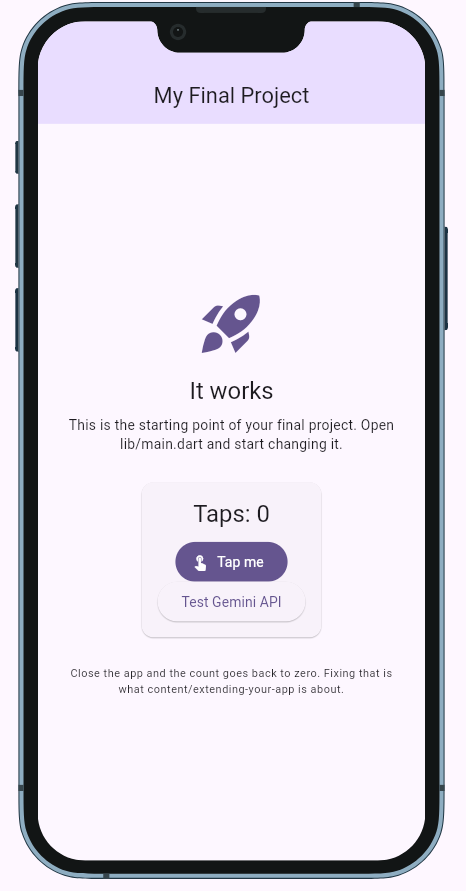

<!--
  This is your project's front page. Replace every placeholder below.
  It is the first thing your instructor and any future employer will read, and
  the live link in it is how your project gets opened for grading.

  New here? Read START-HERE.md first. Delete this comment when you are done.
-->

**Live demo:** https://alzltrav.github.io/Delitess_app/ <!-- GitHub Pages is set up already; replace if you host elsewhere -->
**Demo video:** `docs/demo.mp4` (link it here once it exists)
**Course:** Applications Development and Emerging Technologies (6ADET), Holy Angel University
**Author:** Travis Alzola

This repository lives in the author's own GitHub account and is public on
purpose. There is no `student.json` here and there should not be one: see
`docs/06-security-and-privacy.md` for what a public repo means for secrets and
personal data.

---

# DELITESS
[![Made with AI]][(https://img.shields.io/badge/Made_with-AI_assistance-blue)](AI-USAGE.md)

Built with help from Claude (Anthropic) & Gemini - see [AI-USAGE.md](AI-USAGE.md) for exactly how.

## 1. Overview

DELITESS is a Flutter-based recipe-tracker application. It allows users to snap photos of food, uses the Google Gemini API to identify the dish, and generates custom recipes. It is designed for home cooks who want quick meal inspiration from ingredients or dishes they see.

## 2. Setup and installation
- **Environment:** Built with Flutter.
- **Clone:** `git clone https://github.com/alzltrav/Delitess_app`
- **Dependencies:** Run `flutter pub get`
- **Configuration:** Create a `.env` file in the root directory. Add your Gemini API key like this: `GEMINI_API_KEY=YOUR_API_KEY_HERE`. (Never commit the real key!)

## 3. How to run it
Run the app on Chrome using:
`flutter run -d chrome`

When the app successfully boots, you will see a starting screen with a tap counter and a test button for the API.

## 4. Features and usage
*Currently in Week 1 Development.*
- **Persistent Tap Counter:** Tests local device storage using `shared_preferences`. Tap the button, close the app, and reopen it to verify the count is saved.
- **Gemini API Spike:** Tap "Test Gemini API" to open the device gallery. Select a food image, and the app will send it to the Gemini 3.6-flash model. Check the IDE debug console to read the generated recipe.

## 5. Project structure
- `lib/main.dart`: Contains the main application setup, the `_testGemini` API integration spike, and the `shared_preferences` tap counter.
- `pubspec.yaml`: Manages dependencies including `google_generative_ai`, `image_picker`, `shared_preferences`, and `flutter_dotenv`.
- `.env`: (Ignored in git) Holds the Gemini API key.

## 6. Screenshots

## 7. Known issues and next steps
- **Current state:** The app currently relies on the console to print the AI recipe. The UI is not yet built out.
- **Next steps:** Build out the 4 primary UI screens (Home/Ask AI, Search, Recipe Detail, Saved) using the Midterm Design System and connect the AI text directly to the UI.

## AI Usage
This project is being built with AI assistance for the "Builds with Flutter and AI" badge. Please see [AI-USAGE.md](AI-USAGE.md) for transparent logs of all AI interactions, prompts, and independent code contributions.

MIT, see [LICENSE](LICENSE). Change it if you want different terms.
