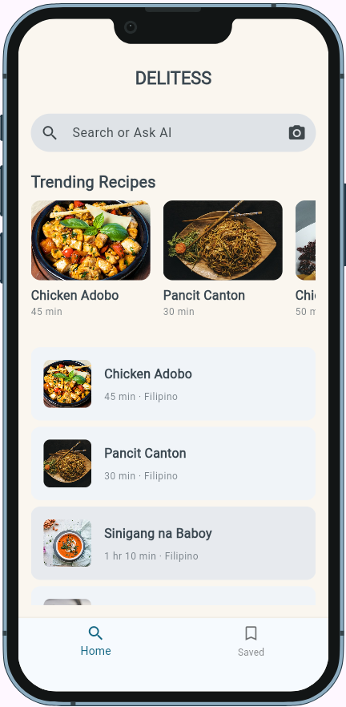
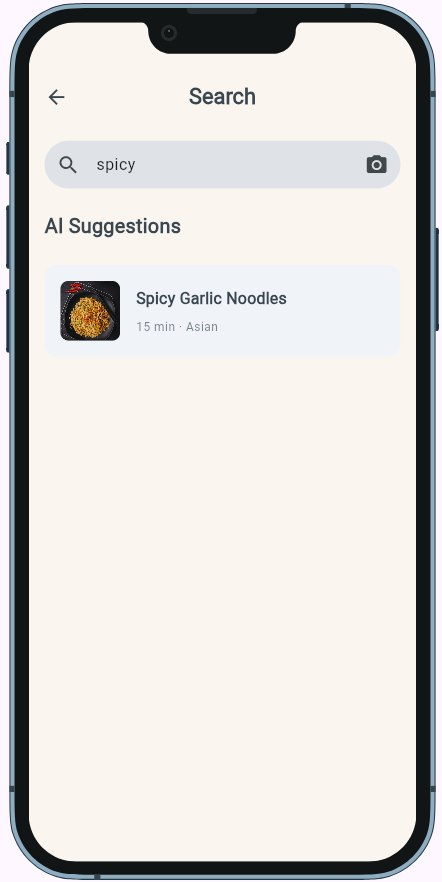
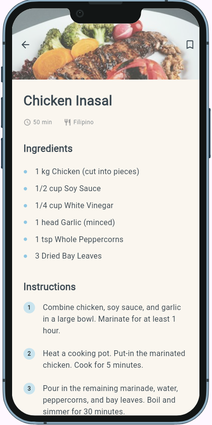
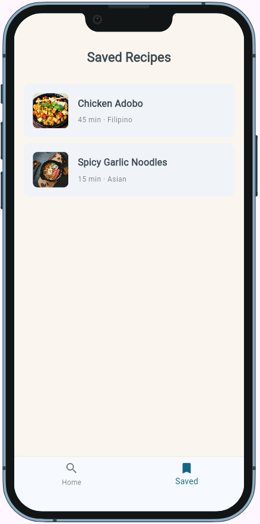

# Mockup and wireframes

The visual plan for this app. Your wireframes answered what goes where; the mockup shows what it looks like[cite: 66].

## Mockup

Visual documentation files in `docs/assets/`:
- [DELITESS Mockup (PDF)](assets/DELITESS_Mockup.pdf)[cite: 58]
- [DELITESS Wireframe (PDF)](assets/DELITESS_Wireframe.pdf)[cite: 47]

### Home / Ask AI

- Primary entry point showing the `DELITESS` app bar, Dark Mode toggle, `AskAiComposer`, horizontal auto-scrolling `Trending Recipes` carousel, and featured recipe cards[cite: 58, 63].

### Search Results

- Displays query input in the composer bar, loading state during API calls, and candidate recipe cards matching the search term or image[cite: 59, 64].

### Recipe Detail

- Features a collapsible hero food image, title, prep time and cuisine metadata row, bulleted ingredients, numbered instructions, and a persistent bookmark icon.

### Saved Recipes

- Displays all recipes bookmarked by the user, supporting both network thumbnails and Base64-decoded gallery photos, with an empty state when no items are saved[cite: 65].

---

## Wireframes

Sketches and screen flows are documented in [`assets/DELITESS_Wireframe.pdf`](assets/DELITESS_Wireframe.pdf) and on [Figma](https://www.figma.com/design/XCx8DKKn8vnbKS73SBBngN/Wireframe-Delitess?node-id=0-1&t=6pAciWqrgSv2mqzN-1)[cite: 47, 57].

### Screen Flow

```text
[Home / Ask AI] (Entry point)
  │
  ├── Types dish/ingredient ────────► [Search Results]
  │                                        │
  │                                        └── Taps a recipe ──► [Recipe Detail]
  │                                                                   │
  ├── Attaches photo (Confident AI) ──────────────────────────────────┤
  │                                                                   ▼
  ├── Taps a trending / featured card ──────────────────────────► [Recipe Detail]
  │                                                               (Ingredients + Steps)
  │                                                               (Save toggle)
  │                                                                   │
  └── Bottom nav taps "Saved" ──────► [Saved Recipes] ◄───────────────┘
                                      (List or empty state)
                                           │
                                           └── Taps a recipe ──► [Recipe Detail]